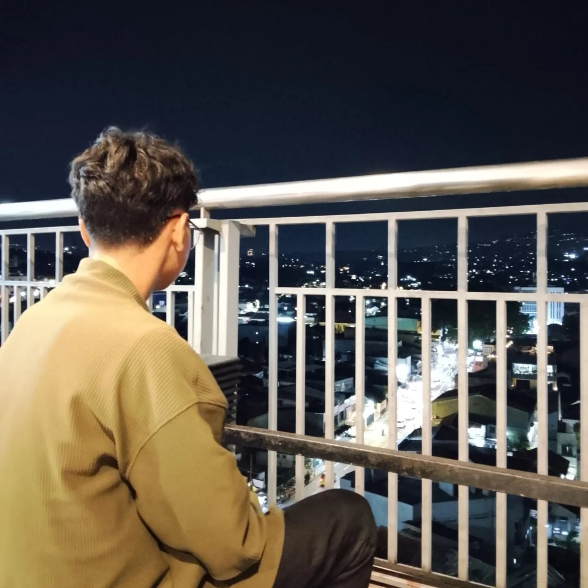
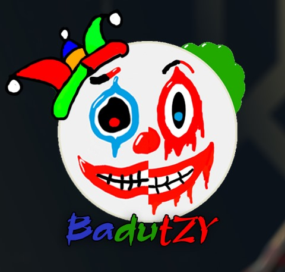
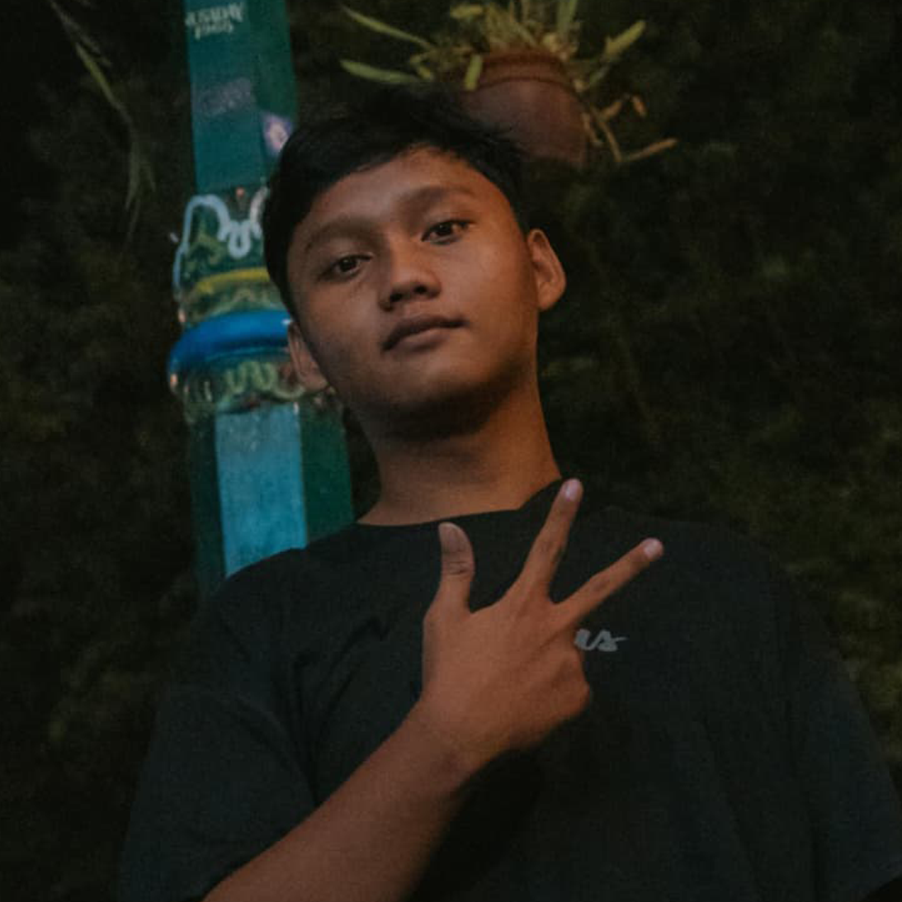

# I.R.I Jaya Jaya Jaya

**A 3-person team competing in INCEPTION VOL. 2 2026.**

---

## About Us

We are a team of 3 students working together under the name **I.R.I Jaya Jaya Jaya**. This GitHub organization is the home for every project we build for the competitions we take part in. Each repository here documents our process, from the first idea to the final submission.

- **Vision** - To build well-structured, reliable, and meaningful web projects through solid teamwork.
- **Mission** - To turn every competition into a chance to learn, collaborate, and deliver work that we are proud of.

The name I.R.I comes from the initials of our team members.

---

## About the Competition

| Detail | Information |
| :--- | :--- |
| Competition | INCEPTION VOL. 2 2026 |
| Category | Website Development |
| Task | Build a School Profile Website |
| Team Size | 3 members |
| Team Name | I.R.I Jaya Jaya Jaya |

---

## Our Project

### School Profile Website

Our entry for INCEPTION VOL. 2 2026 is a **School Profile Website**: a web platform that presents a school's identity, information, and activities in a clean, modern, and easy-to-navigate way. The project is built with the Laravel framework, using PHP for the backend logic and Blade for the templating layer.

**Project highlights**

- Informative pages that introduce the school, its profile, and its programs
- Clean and responsive layout that works on desktop and mobile
- Structured Laravel codebase that is easy to maintain and extend
- Reusable Blade components for consistent page design

---

## Tech Stack

       

---

## Our Team

 

**Irsyadhan Azryawan**

 

**Rizky Maulana Putra**

 

**Irsyad Musyaffa**

---

*I.R.I Jaya Jaya Jaya - built for INCEPTION VOL. 2 2026.*

[Back to Top](#iri-jaya-jaya-jaya)

